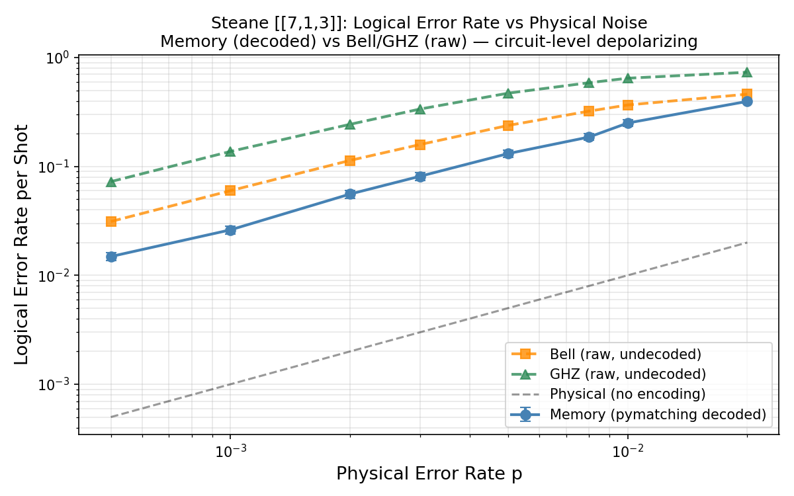
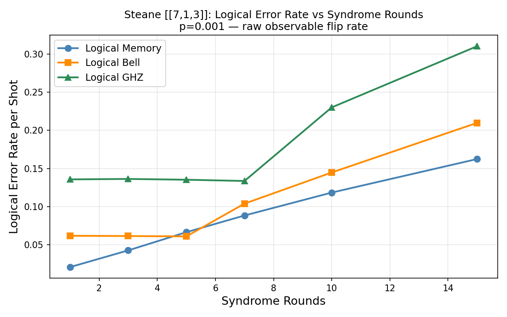
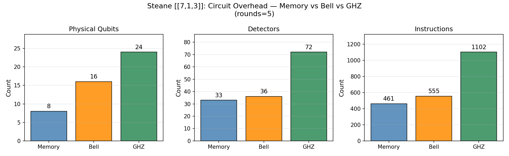

# Logical-Circuit-Benchmarks

**Fault-Tolerant Clifford Circuit Benchmarking on the Steane [[7,1,3]] Code**

A comparative benchmarking study of logical error rates and circuit overhead across three Clifford circuits of increasing complexity — memory, Bell state, and GHZ state — implemented on the Steane [[7,1,3]] quantum error correcting code using [Stim](https://github.com/quantumlib/Stim) and [PyMatching](https://github.com/oscarhiggott/PyMatching).

---

## What this project does

Quantum error correction (QEC) research typically benchmarks codes using memory experiments — preserving a single logical qubit over many syndrome rounds. This project goes further by asking: **how does logical fidelity degrade as you run more complex multi-qubit Clifford circuits on encoded qubits?**

We implement and benchmark three circuits on the Steane [[7,1,3]] code:

| Circuit | Logical Qubits | Physical Qubits | Key Gates |
|---|---|---|---|
| Memory | 1 | 8 | Syndrome extraction only |
| Logical Bell State | 1 (2 obs.) | 16 | H_L + CNOT_L |
| Logical GHZ State | 2 (2 obs.) | 24 | H_L + CNOT_L × 2 |

For each circuit we measure:
- Logical error rate vs physical noise rate
- Logical error rate vs number of syndrome rounds
- Circuit overhead: qubits, detectors, instruction count

---

## Key findings

**1. Circuit complexity degrades logical fidelity nonlinearly.**
At p=0.001, the logical GHZ error rate (~13.7%) is 5× higher than the decoded Memory error rate (~2.5%). Adding more logical qubits and entangling gates amplifies the effect of noise beyond what qubit count alone would predict.

**2. Multi-block circuits show a syndrome round plateau.**
The Bell state error rate stays flat (~6%) from rounds 1–5 before increasing. The GHZ error rate stays flat (~13.5%) from rounds 1–7 before jumping sharply. This plateau indicates a regime where syndrome extraction successfully tracks errors, followed by a transition where error accumulation dominates. No such plateau exists for the memory circuit.

**3. Syndrome extraction overhead scales superlinearly with circuit complexity.**
From Memory to GHZ: qubits scale 3×, detectors scale 2.2×, instructions scale 2.4×. The disproportionate growth in instruction count reflects the interleaved syndrome rounds between logical gates.

**4. The decoded Memory circuit achieves below-physical-rate error suppression at low noise.**
At p=0.0005, the pymatching-decoded Memory circuit achieves ~1.3% logical error rate vs 0.05% physical — consistent with d=3 pseudo-threshold behavior under circuit-level noise.

---

## Results

### Plot 1: Logical Error Rate vs Physical Noise


Memory circuit decoded with PyMatching. Bell and GHZ use raw observable flip rate (see [Limitations](#limitations)).

### Plot 2: Logical Error Rate vs Syndrome Rounds


At p=0.001. Shows the plateau-then-jump pattern for multi-block circuits.

### Plot 3: Circuit Overhead


---

## Project structure

```
ft-clifford-bench/
  steane.py                  # Steane [[7,1,3]] code — stabilizers, encoding, syndrome extraction, logical gates
  bell_ghz.py                # Logical Bell state and GHZ state circuits
  comparative_analysis.py    # Phase 3: all three analyses + plots
  run_overhead.py            # Standalone overhead table generator
  verify_phase1.py           # 8 checks: stabilizers, encoding, logical gates
  verify_phase2.py           # 7 checks: Bell and GHZ state correctness
  verify_phase3.py           # 6 checks: noise sweep, sampling, sinter
  results/                   # Generated plots
```

---

## Installation

```bash
pip install stim~=1.15 pymatching~=2.0 sinter~=1.14 numpy matplotlib
```

---

## Running

**Verify Phase 1 (Steane code):**
```bash
python verify_phase1.py
```

**Verify Phase 2 (Bell + GHZ):**
```bash
python verify_phase2.py
```

**Verify Phase 3 (sampling + sinter):**
```bash
python verify_phase3.py
```

**Run full comparative analysis (~10 minutes):**
```bash
python comparative_analysis.py
```

---

## Implementation details

### Steane [[7,1,3]] code

Stabilizer generators from the [[7,4,3]] Hamming code parity check matrix (standard convention from [errorcorrectionzoo.org](https://errorcorrectionzoo.org/c/steane) and Wikipedia):

```
X-type:  IIIXXXX   IXXIIXX   XIXIXIX
Z-type:  IIIZZZZ   IZZIIZZ   ZIZIZIZ
```

Logical operators: X_L = XXXXXXX, Z_L = ZZZZZZZ (transversal).

Encoding circuit: Goto (2015) scheme via [rlftqc](https://github.com/remmyzen/rlftqc) — H on qubits 0,1,3 followed by 8 CNOTs.

Syndrome extraction uses a single ancilla qubit (qubit 7) reused sequentially for all 6 stabilizers. This is correct but creates cross-block hyper-errors under depolarizing noise (see Limitations).

### Logical gates

All gates are transversal — applied qubit-by-qubit across the code block:
- **H_L**: valid because Steane is self-dual CSS (H swaps X ↔ Z stabilizers)
- **CNOT_L**: valid for all CSS codes (transversal CNOT preserves stabilizer structure)
- **X_L, Z_L**: minimum weight representatives (transversal)

### Noise model

Circuit-level depolarizing noise: `DEPOLARIZE2(p)` on each two-qubit gate during syndrome extraction, `X_ERROR(p)` on ancilla measurements. This is the standard circuit-level noise model used in QEC benchmarking.

---

## Limitations

**Sequential ancilla reuse creates undecomposable hyper-errors.**
Our syndrome extraction reuses a single ancilla qubit sequentially for all 6 stabilizers. Under depolarizing noise, Y-type errors on this ancilla trigger detectors across multiple blocks simultaneously, creating hyperedges with >15 symptoms that PyMatching cannot decompose into graphlike edges.

As a result:
- Memory circuit: fully decoded with PyMatching ✓
- Bell/GHZ circuits: raw observable flip rate reported (no decoding) — logical error rates are pessimistic upper bounds

The correct fix is parallel syndrome extraction using one dedicated ancilla per stabilizer. This would eliminate cross-block correlations and allow PyMatching decoding on all circuits. This is left as future work.

**Single distance code.**
The Steane [[7,1,3]] code has fixed distance d=3. A threshold crossing plot (where logical error rate improves with code distance) requires a family of codes at multiple distances (e.g. surface codes d=3,5,7). This project instead characterizes circuit complexity overhead at fixed distance, which is a complementary benchmark.

---

## References

1. Steane, A. (1996). Multiple-particle interference and quantum error correction. *Proc. R. Soc. Lond. A*, 452, 2551–2577.
2. Gidney, C. (2021). Stim: a fast stabilizer circuit simulator. *Quantum*, 5, 497. https://doi.org/10.22331/q-2021-07-06-497
3. Higgott, O. (2021). PyMatching: A Python package for decoding quantum codes with minimum-weight perfect matching.
4. Goto, H. (2016). Minimizing resource overheads for fault-tolerant preparation of encoded states of the Steane code. *Scientific Reports*, 6, 19578.
5. QAS2024 Tutorial — Fault-Tolerant Quantum Computing with CSS codes. https://enccs.github.io/qas2024/notebooks/css_code_steane/
6. Error Correction Zoo — Steane [[7,1,3]] code. https://errorcorrectionzoo.org/c/steane

---

## Verification

All circuits are verified before benchmarking:

| Check | Result |
|---|---|
| All 6 stabilizers mutually commute | ✓ |
| X_L, Z_L commute with stabilizers and anticommute with each other | ✓ |
| Encoding circuit satisfies all 6 stabilizers (+1 eigenvalue) | ✓ |
| Zero-noise memory circuit: 0 detector fires, 0 logical errors / 1000 shots | ✓ |
| X_L maps \|0⟩_L → \|1⟩_L (Z_L expectation: +1 → -1) | ✓ |
| H_L·H_L = Identity | ✓ |
| H_L maps X_L ↔ Z_L (logical Hadamard property) | ✓ |
| Bell state stabilizers: X_L⊗X_L = +1, Z_L⊗Z_L = +1 | ✓ |
| Bell measurement correlations: Z_L(0) = Z_L(1) in 1000/1000 shots | ✓ |
| GHZ stabilizers: X_L⊗X_L⊗X_L, Z_L⊗Z_L⊗I, I⊗Z_L⊗Z_L all +1 | ✓ |
| GHZ correlations: all three Z_L equal in 1000/1000 shots | ✓ |
